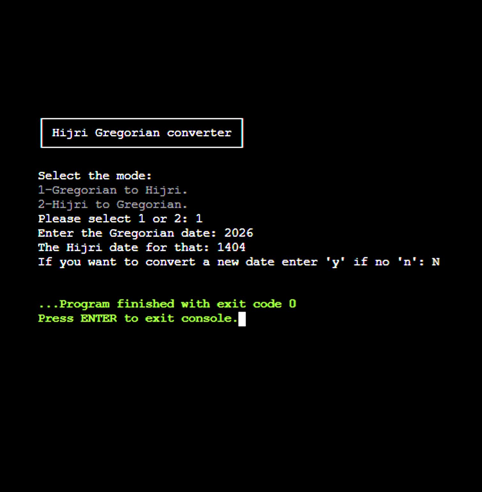
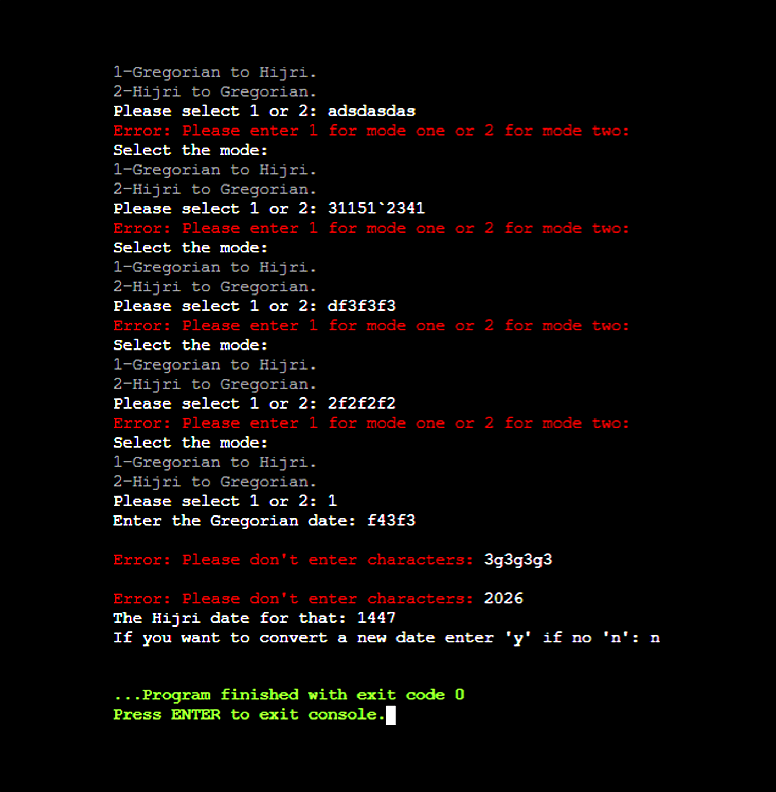
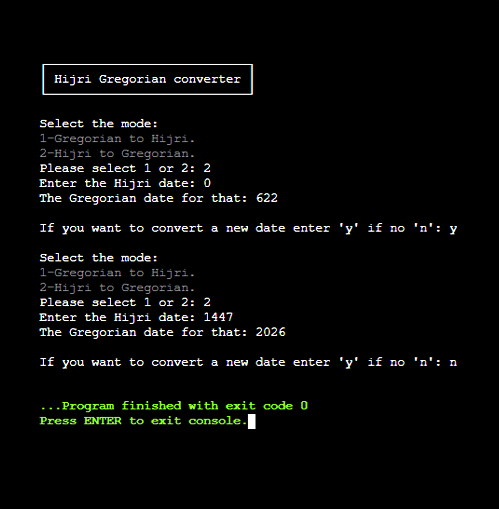
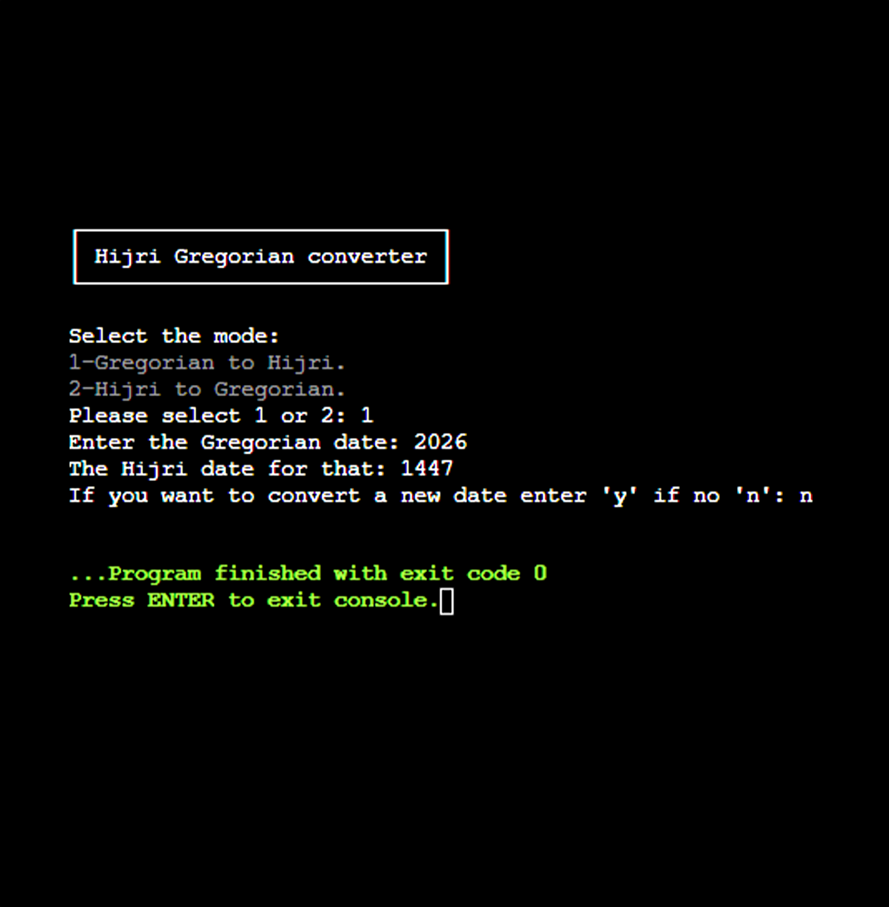

# Hijri Gregorian Converter


A simple console-based date conversion program written in pure C. The project provides a basic interface for converting between Gregorian and Hijri years while practicing functions, switch statements, input validation, loops, and user interaction in C.

## Features

✅ **Gregorian to Hijri Conversion:** Converts a Gregorian year to an approximate Hijri year.  
✅ **Hijri to Gregorian Conversion:** Converts a Hijri year to an approximate Gregorian year.  
✅ **Interactive Console Interface:** Provides a simple menu for selecting the desired conversion mode.  
✅ **Input Validation:** Handles invalid mode selections and prompts the user to enter a valid option.  
✅ **Repeated Conversions:** Allows users to perform multiple conversions without restarting the program.  
✅ **Error Handling:** Validates the user's choice when continuing or exiting the program.  
✅ **Written in Pure C:** Uses standard C libraries and basic programming concepts.  

## Screenshots

| Main Menu | Error Handling |
| --------- | ------------------ |
|  |  |

| Hijri to Gregorian | Gregorian to Hijri |
| ------------------- | -------------- |
|     |    |


## Algorithm Logic (Pseudocode)

```textSTART PROGRAM
    INITIALIZE newConversion = 'y'
    
    WHILE newConversion IS 'y' OR 'Y':
        DISPLAY conversion menu (1: Gregorian -> Hijri, 2: Hijri -> Gregorian)
        READ mode choice
        
        IF mode is VALID (1 or 2):
            READ input date
            CALCULATE and DISPLAY converted date via conversionOpertaion()
            
            PROMPT user for another conversion ('y' / 'n')
            READ newConversion
            
            WHILE newConversion IS NOT ('y', 'Y', 'n', 'N'):
                FLUSH input buffer
                DISPLAY error message
                READ newConversion
                
            IF newConversion IS 'n' OR 'N':
                BREAK loop
        ELSE:
            FLUSH input buffer
            DISPLAY mode selection error message

END PROGRAM
```


## How It Works

1. The user selects a conversion mode from the main menu.
2. The user enters either a Gregorian or Hijri year depending on the selected mode.
3. The program performs the corresponding conversion.
4. The converted year is displayed in the console.
5. The user can choose to perform another conversion or exit the program.


## 📥 Cloning & Running the Program  

## Cloning the Repository

To get started, clone this repository using Git:
```bash
git clone https://github.com/ALAADROID/Hijri-Gregorian-Converter.git
cd Hijri-Gregorian-Converter
```

### 🛠️ Compilation
To compile the program using GCC:
```bash
gcc -o hijri_gregorian_converter main.c
```

## 🚀 Running the Program
After compiling, run the generated executable:
```bash
./hijri_gregorian_converter
```

## 📌 Notes
- The conversion uses a simplified year-based formula.

- This program is designed as an educational exercise and provides approximate year conversions.

- Make sure your terminal supports ANSI escape codes for styled color output.

- On Windows, you can compile and run this using MinGW, GCC, WSL, or any modern terminal environment.


## 💻 Running the Program Locally

If you'd like to experiment with the project locally, clone the repository, compile main.c using GCC, and run the generated executable.

You can also modify the source code to improve the conversion algorithm, add more accurate date calculations, or extend the program with additional calendar functionality.

---

**Developed by [ALAADROID](https://github.com/ALAADROID)**
